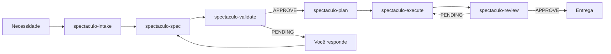

# 🎭 SpecTaculo

> **Spec Driven Development sem drama.**  
> Uma esteira de agentes de IA que especifica antes de codar, para que você nunca mais descubra no final que "não era bem isso".

[](https://github.com/JonathanBencke/SpecTaculo)
[](https://github.com/JonathanBencke/SpecTaculo/actions/workflows/ci.yml)
[](https://python.org)
[](https://docs.microsoft.com/powershell)
[]()

---

## 🤔 O que é o SpecTaculo?

O **SpecTaculo** é uma esteira de agentes de IA focada em **Spec Driven Development (SDD)**. Em vez de pedir para a IA "fazer tal coisa" e torcer para o resultado bater com o que você imaginou, a esteira obriga a criação de uma especificação clara **antes** de qualquer código ser escrito.

Ela funciona como uma linha de montagem:

```
Necessidade → Intake → Spec → Validação → Plano → Execução → Review
```

Cada etapa é um agente especializado. Cada agente tem um escopo único, não duplica trabalho e atualiza o `TASK.md` para que você sempre saiba onde a esteira está.

---

## ✨ Por que usar?

| Problema comum | Como o SpecTaculo resolve |
|----------------|---------------------------|
| IA "supõe" requisitos e entrega errado | O agente `spectaculo-validate` bloqueia a esteira se a spec estiver incompleta |
| Você não sabe em que etapa a IA está | O `TASK.md` é atualizado a cada passo |
| Mesma análise é refeita várias vezes | Cada agente lê apenas os artefatos do agente anterior |
| Prompts gigantes e caros | Prompts enxutos com contexto mínimo por agente |
| Trabalha em várias CLIs de IA | Gera skills nativas para Claude Code, kimi-code, opencode e kiro-cli |

---

## 🚀 Instalação

### Requisitos

- Python 3.11+
- PowerShell 5.1+ (Windows) ou PowerShell Core / Bash (Linux/macOS)
- Git (opcional, para instalação local)

### Instalação rápida via `irm` (Windows, recomendada)

No diretório do seu projeto:

```powershell
# Para Claude Code
$env:SPECTACULO_TOOL = "claude"; irm https://raw.githubusercontent.com/JonathanBencke/SpecTaculo/main/install.ps1 | iex

# Para todas as CLIs de uma vez
$env:SPECTACULO_TOOL = "all"; irm https://raw.githubusercontent.com/JonathanBencke/SpecTaculo/main/install.ps1 | iex
```

### Instalação rápida via `curl` (Linux/macOS, recomendada)

```bash
# Para opencode
curl -fsSL https://raw.githubusercontent.com/JonathanBencke/SpecTaculo/main/install.sh | SPECTACULO_TOOL=opencode bash

# Para todas as CLIs de uma vez
curl -fsSL https://raw.githubusercontent.com/JonathanBencke/SpecTaculo/main/install.sh | SPECTACULO_TOOL=all bash
```

> **Não precisa de Git, Python ou clonar o repositório.** O script baixa o release mais recente (com verificação de checksum SHA256 quando disponível) e instala tudo automaticamente.

### Instalação via pip (modo gerador)

Se você só quer usar o gerador de artefatos como biblioteca/CLI:

```bash
pip install -e .
spectaculo-generate all --clean
```

### Instalação local (clone)

```powershell
# Clone o repositório
git clone https://github.com/JonathanBencke/SpecTaculo.git
cd SpecTaculo

# Instale as dependências
python -m venv .venv
.\.venv\Scripts\activate
pip install -r requirements-dev.txt
pip install -e .

# Instale no projeto alvo
.\install.ps1 -Tool claude -Generate -Target ..\meu-projeto
```

### Parâmetros do instalador

| Parâmetro (PS)        | Parâmetro (bash)   | Descrição                                                       |
|-----------------------|--------------------|-----------------------------------------------------------------|
| `-Tool`               | `-t/--tool`        | CLI alvo: `claude`, `kimi`, `opencode`, `kiro` ou `all`         |
| `-Target`             | `-d/--target`      | Diretório de destino (padrão: atual)                            |
| `-Generate`           | `-g/--generate`    | Regenera os artefatos antes de instalar (modo local)            |
| `-Version`            | `-v/--version`     | Versão/tag específica do GitHub (ex: `v1.3.0`). Padrão: latest  |
| `-Uninstall`          | `-u/--uninstall`   | Remove os artefatos do destino                                  |
| `-Update`             | (use `-g`)         | Regenera e reinstala (modo local)                               |

> Se `generated/` estiver ausente no modo local, o instalador tenta gerá-lo automaticamente (desde que o Python esteja disponível).

---

## 🎬 Uso

Após instalar, invoque o orquestrador na CLI escolhida:

### Claude Code

```text
/spectaculo-run #42 Preciso de um endpoint Flask que receba nome e email, valide o email e salve em CSV
```

### kimi-code

```text
/spectaculo-run PROJ-456 Preciso refatorar o módulo de autenticação para usar JWT
```

### opencode

```text
/agent spectaculo-run Preciso de uma página de login com validação de campos
```

### kiro-cli

```text
/agent swap spectaculo-run
```

Depois digite a task no chat. O `spectaculo-intake` identificará o ID (GitHub, Jira) ou sugerirá um nome para a pasta em `specs/`.

---

## 🧩 Os agentes

| Agente | Emoji | Função |
|--------|-------|--------|
| `spectaculo-intake` | 🚪 | Recebe a task, coleta contexto, identifica gaps e detecta o changelog do projeto |
| `spectaculo-spec` | 📝 | Escreve a especificação formal (`<Spec Dir>/SPEC.md`) |
| `spectaculo-validate` | 🛡️ | Revisa a spec e bloqueia se estiver incompleta |
| `spectaculo-plan` | 🗺️ | Cria o plano executável (`<Spec Dir>/PLAN.md`) |
| `spectaculo-execute` | ⚒️ | Executa o plano, produz código/artefatos e atualiza o changelog se existir |
| `spectaculo-review` | ✅ | Valida a entrega contra a spec e o changelog |
| `spectaculo-run` | 🎭 | Orquestrador que coordena toda a esteira |

### Fluxo da esteira



---

## 📁 Artefatos gerados

A esteira mantém três artefatos principais no seu projeto, organizados em subpastas dentro de `specs/`:

```
specs/
├── GH-42/                       # ID do GitHub
│   ├── TASK.md
│   ├── SPEC.md
│   └── PLAN.md
├── PROJ-456/                    # ID do Jira
│   ├── TASK.md
│   ├── SPEC.md
│   └── PLAN.md
└── endpoint-flask-csv/          # Nome sugerido para input sem ID
    ├── TASK.md
    ├── SPEC.md
    └── PLAN.md
```

- **`<Spec Dir>/TASK.md`** — Todo-list central. Sempre atualizado com a fase atual, checklist e decisões pendentes.
- **`<Spec Dir>/SPEC.md`** — Especificação formal: escopo, critérios de aceite, contratos e decisões pendentes.
- **`<Spec Dir>/PLAN.md`** — Plano executável com passos ordenados e verificáveis.

### Como o `<Spec Dir>` é escolhido?

O agente `spectaculo-intake` decide automaticamente:

| Tipo de entrada | Exemplo | `<Spec Dir>` resultante |
|-----------------|---------|-------------------------|
| Issue/PR do GitHub | `#42` ou URL de issue | `specs/GH-42/` |
| Ticket do Jira | `PROJ-456` | `specs/PROJ-456/` |
| Texto puro | "Preciso de uma página de login..." | `specs/pagina-login/` (sugerido; usuário confirma) |

---

## 📝 Changelog

Se o seu projeto já tiver um arquivo de changelog (ex: `CHANGELOG.md`, `HISTORY.md`, `RELEASES.md`), o SpecTaculo detecta automaticamente:

- **`spectaculo-intake`** → identifica o arquivo e o padrão usado.
- **`spectaculo-execute`** → adiciona uma entrada compatível com a mudança implementada.
- **`spectaculo-review`** → verifica se o changelog foi atualizado corretamente.

Se o padrão do changelog não for reconhecido, a esteira para e pede orientação ao invés de bagunçar o arquivo.

---

## 🏗️ Arquitetura do projeto

```
SpecTaculo/
├── src/
│   ├── agents/           # Fonte única YAML de cada agente
│   ├── templates/        # Templates Jinja2 por CLI + body compartilhado
│   ├── schema.py         # Validação (pydantic) do YAML dos agentes
│   └── generate.py       # Gerador de artefatos nativos
├── tests/                # pytest (schema, generate, templates)
├── docs/                 # agent-schema.md e demais docs
├── examples/             # Exemplo ponta-a-ponta (TASK/SPEC/PLAN/STATE)
├── generated/            # Artefatos gerados (não versionar)
├── install.ps1 / .sh     # Instaladores multiplataforma
├── pyproject.toml        # Empacotamento + entry point spectaculo-generate
├── requirements.txt      # Dependências Python de runtime
├── example-task.md       # Exemplo de task para testar
├── AGENTS.md             # Guia para CLIs de IA que mexem neste repo
└── README.md             # Você está aqui
```

---

## 🧪 Exemplo completo

Veja o arquivo [`example-task.md`](./example-task.md) para um exemplo prático de task.

Resumo do exemplo:

> *"Preciso de um endpoint REST em Python/Flask que receba um JSON com nome e email, valide o email e salve em um arquivo CSV."*

O SpecTaculo vai:

1. Identificar que o caminho do CSV não foi especificado.
2. Parar e perguntar onde o arquivo CSV deve ser salvo.
3. Só depois criar a `SPEC.md`, o `PLAN.md` e implementar o código.

---

## 🔧 Desenvolvimento

### Gerar artefatos manualmente

```powershell
.\.venv\Scripts\activate
python src/generate.py all --clean
```

### Adicionar um novo agente

1. Crie um arquivo YAML em `src/agents/`.
2. Siga o schema documentado em [`docs/agent-schema.md`](./docs/agent-schema.md):
   `name`, `description`, `entry`, `output`, `rules`, `prompt` (+ opcional
   `mode`, `tools`). Campos extras são rejeitados pelo `AgentSpec` (pydantic).
3. Regenere os artefatos com `python src/generate.py all --clean`.
4. Rode os testes: `pytest tests/ -v`.

### Customizar templates

Edite os arquivos em `src/templates/`. O corpo comum vive em `_body.md.j2`
(macro `body`) — os wrappers `claude-skill`/`kimi-skill`/`opencode-agent` são
finos e só definem frontmatter. Para o orquestrador, há ainda um bloco de
**Dispatch específico da CLI** (`dispatch_hint`) injetado por formato.

### Exemplo completo (referência)

A pasta [`examples/GH-42/`](./examples/GH-42/) mostra a saída esperada da
esteira sobre a task de [`example-task.md`](./example-task.md):
`TASK.md`, `STATE.json`, `SPEC.md` e `PLAN.md` preenchidos.

---

## 🌍 Suporte a CLIs

| CLI | Formato gerado | Caminho de instalação |
|-----|----------------|----------------------|
| Claude Code | Skill | `.claude/skills/<agente>/SKILL.md` |
| kimi-code | Skill | `.kimi-code/skills/<agente>/SKILL.md` |
| opencode | Agent | `.opencode/agents/<agente>.md` |
| kiro-cli | Agent JSON | `.kiro/agents/<agente>.json` |

---

## 🎯 Filosofia

1. **Especificar antes de codar.** Código sem spec é palpite.
2. **Parar é melhor que supor.** Se falta informação crítica, a esteira pergunta.
3. **Um agente, um papel.** Não desperdice tokens repetindo análises.
4. **Transparência total.** O `TASK.md` mostra o estado em tempo real.

---

## 🤝 Contribuindo

Contribuições são bem-vindas! Abra uma issue ou pull request em [JonathanBencke/SpecTaculo](https://github.com/JonathanBencke/SpecTaculo).

---

## 📄 Licença

Distribuído sob licença MIT. Veja [`LICENSE`](./LICENSE) para mais detalhes.

---

> **SpecTaculo** — *Especificar é preciso, codar é necessário, supor é proibido.* 🎭
